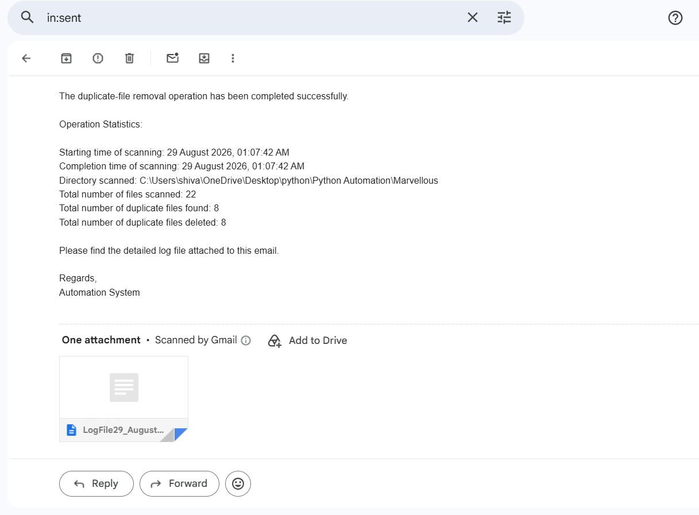

# Duplicate File Removal Automation

A Python-based automation tool that recursively scans a directory, detects duplicate files using MD5 checksums, removes duplicate copies, generates execution logs, and sends an email report.

## Features

- 🔍 Recursively scans directories for files
- 🔐 Detects duplicate files using MD5 checksums
- 🗑️ Automatically removes duplicate files
- 📝 Generates detailed execution logs
- 📧 Sends automated email reports
- ⏰ Supports scheduled execution
- ✅ Validates directory paths and email addresses
- ⚠️ Handles file and permission-related errors
- 💻 Command-line interface with help and usage options

## Screenshots

### Terminal Execution


### Email Report



### Log File


## How It Works

1. The user provides a directory path, email address, and execution interval.
2. The program validates the provided inputs.
3. All files inside the directory and its subdirectories are scanned.
4. An MD5 checksum is generated for each file.
5. Files with identical checksums are identified as duplicates.
6. The first occurrence of a file is retained.
7. Subsequent duplicate files are removed.
8. A log containing execution details is generated.
9. An email report is sent with the results.
10. The operation can be repeated automatically at the specified interval.

## Technologies Used

- Python
- `os`
- `sys`
- `re`
- `hashlib`
- `datetime`
- `smtplib`
- `email`
- `schedule`

## Installation

Clone the repository:

```bash
git clone https://github.com/bemo-codes/DuplicateFileRemoval.git